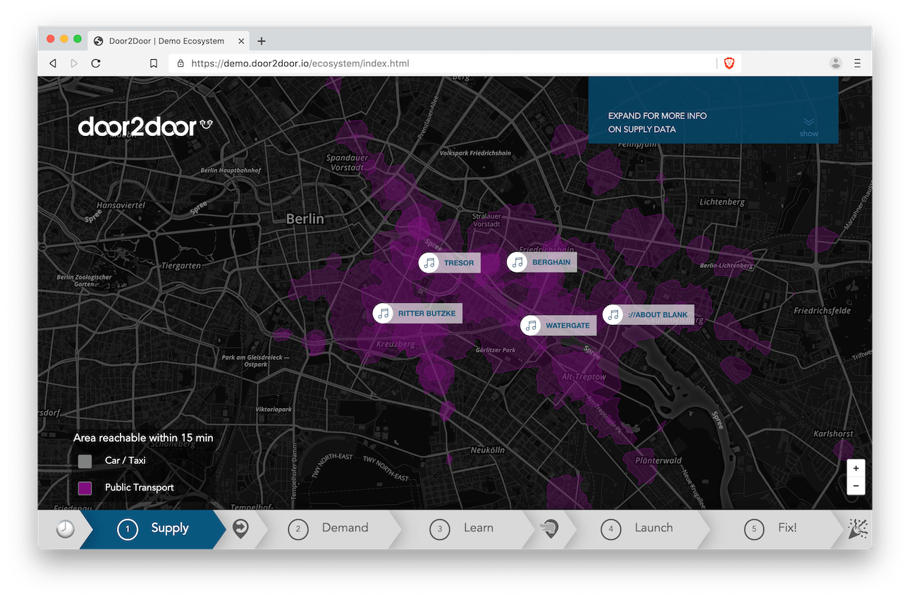

Mobility analytics tool to analyse public transport data and movement patterns to understand mobility in a region.

`Tech Stack:` JavaScript ・ React JS ・ MobX ・ Mapbox GL JS ・ JSS ・ Python

---

Demo web app to explain ridepooling in comparison to taxi and public transport.

`Tech Stack:` JavaScript ・jQuery ・ Leaflet.js ・ HTML ・ CSS

---

Interactive visualisation of raster data within a WebGIS environment.

`Tech Stack:` JavaScript ・ Leaflet.js ・ GDAL

---

Map cake made with love.

`Cake Stack:` Biscuit ・ Salted Carmel ・ Dark & White Chocolate
